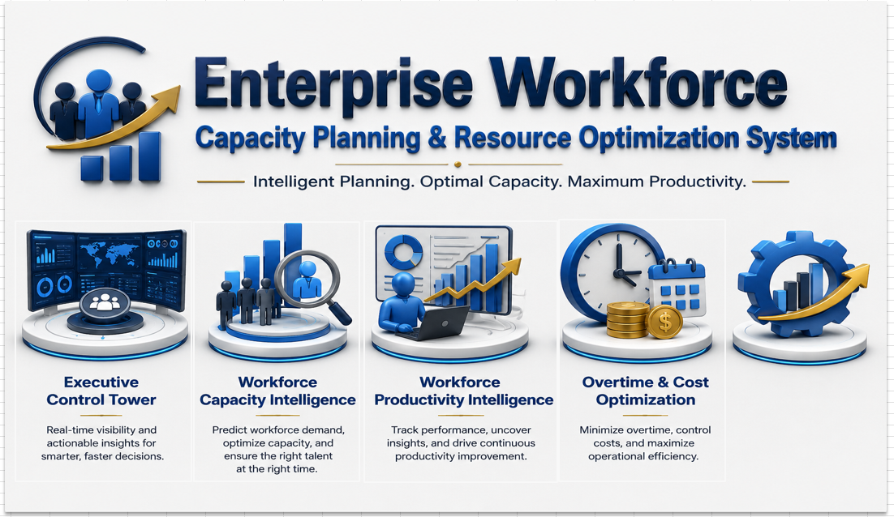
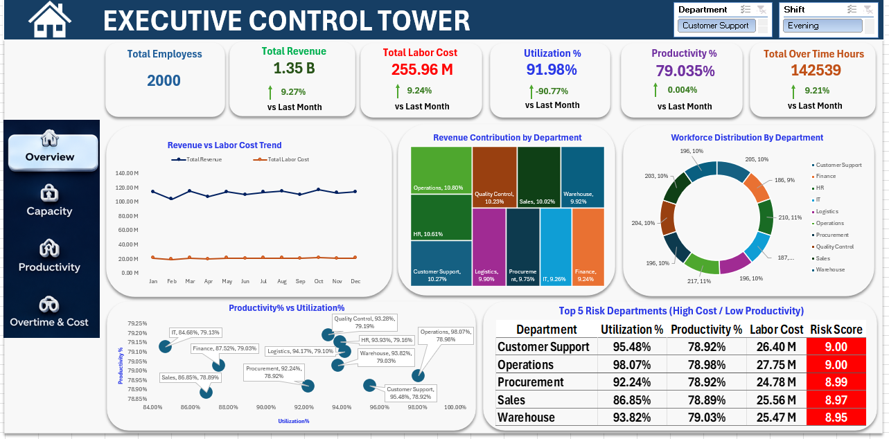
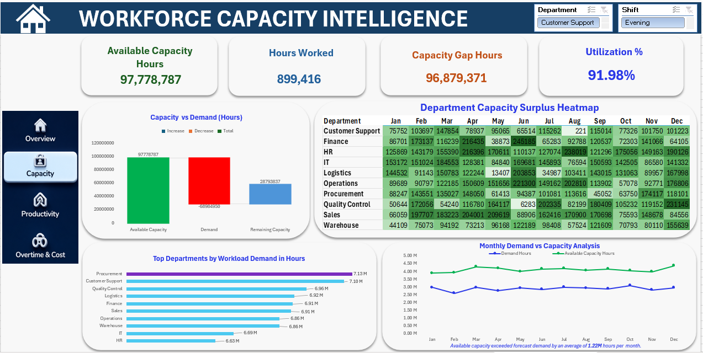
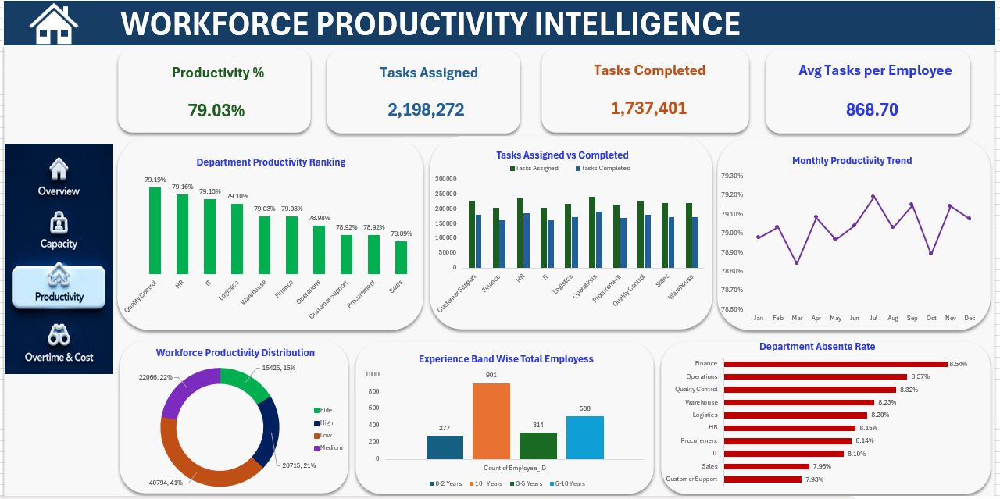
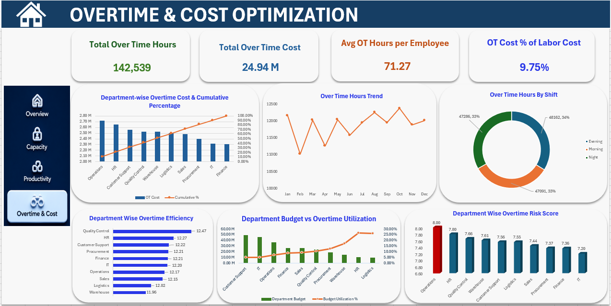

# 👥 Enterprise Workforce Capacity Planning & Resource Optimization System

This dashboard helps organizations optimize workforce allocation, improve productivity, manage labor costs, and enhance operational efficiency through workforce intelligence and capacity planning.

An end-to-end Business Intelligence project built using:

**Excel → Power Query → Power Pivot → DAX → Dashboarding**

---

---

## 📌 Project Overview

This project is a complete **Enterprise Workforce Analytics & Resource Optimization System**.

The solution was built using workforce, operations, capacity, demand, department, and shift datasets to provide executive-level visibility into workforce performance and operational efficiency.

Using Power Query, the data was cleaned and transformed. A star-schema data model was then created using Power Pivot, followed by advanced DAX measures for workforce planning, productivity monitoring, overtime analysis, capacity optimization, and risk management.

Finally, a fully interactive multi-page Excel dashboard system was developed to analyze:

- Workforce capacity utilization
- Productivity performance
- Labor cost efficiency
- Overtime optimization
- Department risk monitoring
- Workforce demand planning
- Resource allocation effectiveness

---

## 🗂️ Project Workflow

**Raw CSV Files → Power Query → Data Modeling → DAX Measures → Excel Dashboard System**

---

## 🛠️ Tools & Technologies

| Tool | Purpose |
|------|---------|
| Excel | Dashboard Development |
| Power Query | Data Cleaning & Transformation |
| Power Pivot | Data Modeling |
| DAX | KPI & Business Calculations |
| Pivot Tables | Analysis & Reporting |
| Advanced Excel Charts | Visualization |

---

## 📁 Dataset

This project uses multiple workforce-related datasets:

### 1. Employee Dataset
- Employee details
- Department information
- Skill level
- Experience
- Salary

### 2. Operations Dataset
- Hours worked
- Tasks assigned
- Tasks completed
- Overtime hours
- Attendance metrics

### 3. Capacity Dataset
- Available capacity hours
- Capacity allocation
- Workforce availability

### 4. Demand Dataset
- Workload demand
- Forecasted workload
- Resource requirements

### 5. Department Dataset
- Department budget
- Productivity targets
- Organizational structure

### 6. Date Dataset
- Year
- Quarter
- Month
- Week
- Date hierarchy

---

## 🟦 Step 1: Power Query Work

### What I Did

- Imported multiple CSV files
- Cleaned raw workforce data
- Fixed data types
- Removed duplicates
- Handled missing values
- Standardized business formats
- Created structured analytical tables

### Output Tables

- tblEmployee
- tblOperations
- tblCapacity
- tblDemand
- tblDepartment
- tblCalendar

---

## 🟨 Step 2: Data Modeling

### Star Schema Design

Created relationships between:

### Dimension Tables

- Employee
- Department
- Calendar
- Shift

### Fact Tables

- Operations
- Capacity
- Demand

### Key Fields

- Employee_ID
- Department_ID
- Shift_ID
- Date
- Hours_Worked
- Tasks_Assigned
- Tasks_Completed
- Overtime_Hours

---

## 🟩 Step 3: DAX Measures

Created advanced workforce analytics KPIs including:

### Workforce KPIs

- Total Employees
- Utilization %
- Productivity %
- Hours Worked
- Capacity Gap Hours
- Revenue Per Employee

### Productivity KPIs

- Tasks Assigned
- Tasks Completed
- Productivity Score
- Avg Tasks Per Employee
- Department Productivity Ranking

### Cost & Overtime KPIs

- Total Labor Cost
- Total Overtime Cost
- OT Cost % of Labor Cost
- Avg OT Hours Per Employee
- Overtime Efficiency Score

### Risk & Optimization KPIs

- Capacity Gap
- Workforce Risk Score
- Budget Utilization %
- Department Risk Ranking
- Overtime Risk Index

---

# 📊 Dashboard Pages

---

## 🟦 Page 1 — Executive Control Tower

### Purpose

Provide executive-level visibility into workforce performance and business operations.

### KPIs

- Total Employees
- Total Revenue
- Total Labor Cost
- Utilization %
- Productivity %
- Total Overtime Hours

### Key Insights

- Revenue vs Labor Cost Trend
- Revenue Contribution by Department
- Workforce Distribution Analysis
- Productivity vs Utilization Analysis
- Top Risk Departments

---

## 🟩 Page 2 — Workforce Capacity Intelligence

### Purpose

Monitor workforce capacity, demand, and resource planning efficiency.

### KPIs

- Available Capacity Hours
- Hours Worked
- Capacity Gap Hours
- Utilization %

### Key Insights

- Capacity vs Demand Analysis
- Department Capacity Surplus Heatmap
- Monthly Demand vs Capacity Trends
- Workforce Capacity Distribution
- Department Demand Ranking

---

## 🟪 Page 3 — Workforce Productivity Intelligence

### Purpose

Analyze workforce productivity, employee performance, and operational effectiveness.

### KPIs

- Productivity %
- Tasks Assigned
- Tasks Completed
- Avg Tasks Per Employee

### Key Insights

- Department Productivity Ranking
- Tasks Assigned vs Completed
- Monthly Productivity Trend
- Productivity Distribution
- Experience Band Analysis
- Department Absenteeism Analysis

---

## 🟦 Page 4 — Overtime & Cost Optimization

### Purpose

Monitor overtime expenses, labor costs, and workforce efficiency.

### KPIs

- Total Overtime Hours
- Total Overtime Cost
- Avg OT Hours Per Employee
- OT Cost % of Labor Cost

### Key Insights

- Overtime Cost Pareto Analysis
- Overtime Hours Trend
- Shift-wise Overtime Analysis
- Department Budget Utilization
- Overtime Efficiency Ranking
- Department Risk Score Analysis

---

## 📸 Dashboard Preview

### 🔹 Home Navigation Dashboard

### 🔹 Executive Control Tower

### 🔹 Workforce Capacity Intelligence

### 🔹 Workforce Productivity Intelligence

### 🔹 Overtime & Cost Optimization

---

## ⭐ Key Features

- Interactive Home Navigation System
- Multi-Page Executive Dashboards
- Power Query ETL Pipeline
- Star Schema Data Modeling
- Advanced DAX KPIs
- Workforce Capacity Planning
- Productivity Intelligence
- Overtime Cost Optimization
- Department Risk Analysis
- Workforce Performance Monitoring
- Capacity Gap Analysis
- Executive Business Insights

---

## 💡 Key Business Insights

- Workforce utilization remained above 90%, indicating strong resource deployment.
- Capacity exceeded workload demand across most departments, reducing staffing risk.
- Overtime contributed less than 10% of total labor cost, demonstrating effective workforce planning.
- Significant productivity differences exist between departments, highlighting improvement opportunities.
- Several departments show elevated risk scores due to higher labor costs and lower productivity.
- Demand remains consistently below available capacity, supporting operational resilience.
- Budget utilization varies across departments, indicating optimization opportunities.

---

## 🧠 Skills Demonstrated

- Power Query
- Data Cleaning
- Data Modeling
- Power Pivot
- DAX
- KPI Development
- Dashboard Design
- Workforce Analytics
- Capacity Planning
- Productivity Analysis
- Cost Optimization
- Risk Analysis
- Data Storytelling

---

## ✅ Project Outcome

This project demonstrates a complete workforce analytics and resource optimization solution.

It helps organizations:

- Improve workforce utilization
- Increase productivity
- Optimize labor costs
- Control overtime spending
- Monitor departmental performance
- Identify operational risks
- Support executive decision-making

---

## 👨‍💻 About Me

**Sayan Naha**

📧 Email: snsayan2012@gmail.com

🔗 LinkedIn: https://www.linkedin.com/in/sayan-naha/
